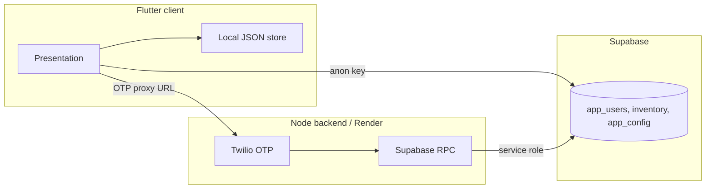

# Zep Pay

Offline-first UPI payments for India: scan a QR code, confirm with biometrics, and pay through carrier rails or UPI apps. Everyday money features — history, requests, splits, ZepCoins, shop, NFC Zep Cards, and semiconductor inventory tracking — sit on a local-first Flutter client.

Live / artifacts: [GitHub Pages PWA](https://mananbharti.github.io/zeppay/) · [Releases](https://github.com/mananbharti/zeppay/releases)

## Table of contents

1. [Overview](#overview)
2. [Features](#features)
3. [Architecture](#architecture)
4. [Repository layout](#repository-layout)
5. [Prerequisites](#prerequisites)
6. [Quick start](#quick-start)
7. [Configuration](#configuration)
8. [Supabase](#supabase)
9. [Backend deployment](#backend-deployment)
10. [Platform support](#platform-support)
11. [Builds and releases](#builds-and-releases)
12. [Design system](#design-system)
13. [Testing](#testing)
14. [Security](#security)

## Overview

Zep Pay targets hackathon demos and real UPI workflows:

- **Android (APK):** Scan a merchant QR, enter an amount, authenticate, then auto-dial `*99#` or **UPI 123PAY** so the user only enters their UPI PIN.
- **Web / PWA:** Flutter web for Android browsers; a separate React site for iPhone (Safari → Add to Home Screen).
- **Backend:** Node OTP proxy on Render with optional Supabase for login census, referrals, inventory, and feature flags.
- **Data:** Transactions and profile data stay on-device in a JSON store. Only hashed phones and admin-controlled cloud tables sync to Supabase.

Development OTP defaults to **`123456`** when Twilio is not configured.

## Features

| Area | Description |
| --- | --- |
| **Payments** | QR scan, amount entry, biometric confirm, USSD / 123PAY / UPI intent rails |
| **Money hub** | Pay friends, UPI ID, bank transfer, bills & recharge, donations (remote toggle) |
| **History & requests** | Ledger, payment requests, autopay scheduling |
| **Split bills** | Groups, expenses, debt simplification, CSV export |
| **ZepCoins** | Earn on payments; spend in partner shop (demo offers) |
| **Zep Card (NFC)** | Program NTAG cards; link batches to Supabase inventory |
| **Semiconductor tracking** | Challenge 2 inventory, risk levels, NFC chip routes |
| **Live State** | Compliance-oriented audit hub |
| **Onboarding** | 4-slide walkthrough, English/Hindi, accessibility toggles |
| **Referrals** | Share codes; local coin rewards backed by Supabase identity |

## Architecture



| Layer | Technology |
| --- | --- |
| Client | Flutter 3.x, Riverpod, go_router |
| Local persistence | JSON file store (`lib/data/local/`) |
| Auth OTP | Twilio via `backend/server.js` |
| Cloud data | Supabase (anon key in app, service role on backend only) |
| Android native | Kotlin telephony bridge, USSD accessibility, NFC |
| iOS / web | PWA handoff to UPI apps; web QR via jsQR overlay |

## Repository layout

```
zeppay/
├── lib/                    # Flutter application source
│   ├── core/               # Theme, routing, platform, widgets
│   ├── data/               # Models, local store, services
│   ├── l10n/               # English + Hindi strings
│   └── presentation/       # Screens (pay, shop, NFC, semiconductor, …)
├── android/                # Kotlin platform channels, USSD, NFC
├── ios/                    # Xcode project and assets
├── web/                    # Flutter web shell (PWA, camera overlay)
├── backend/                # Node OTP + Supabase proxy (deploy to Render)
├── server/                 # Legacy Dart OTP stub (local dev fallback)
├── supabase/               # SQL schemas and full_setup.sql
├── zeppay-pwa/             # React iPhone website
└── .github/workflows/      # APK, PWA, and iOS web CI
```

## Prerequisites

| Tool | Version / notes |
| --- | --- |
| [Flutter](https://docs.flutter.dev/get-started/install) | SDK ≥ 3.5 (`flutter doctor`) |
| [Node.js](https://nodejs.org/) | ≥ 20 for `backend/` |
| Android Studio / Xcode | For device builds |
| Supabase project | Optional; required for cloud features |
| Twilio account | Optional; dev OTP `123456` without it |

## Quick start

### 1. Clone and install

```bash
git clone https://github.com/mananbharti/zeppay.git
cd zeppay
flutter pub get
```

If platform folders are incomplete:

```bash
flutter create . --org in.zeppay --project-name zeppay --platforms android,ios,web
```

### 2. Run the app

```bash
# Android device or emulator
flutter run

# Web (development server)
flutter run -d web-server --web-port=8080
```

### 3. Run the OTP backend locally (optional)

```bash
cd backend
cp env.example .env   # fill in Twilio / Supabase values
npm install
npm start             # listens on :8787
```

Point the app at the proxy:

```bash
flutter run --dart-define=TWILIO_VERIFY_URL=http://127.0.0.1:8787
```

Or set **Settings → OTP PROXY URL** inside the app.

## Configuration

### Flutter build defines

| Variable | Required | Description |
| --- | --- | --- |
| `TWILIO_VERIFY_URL` | No | OTP proxy base URL (no trailing slash) |
| `SUPABASE_URL` | For cloud features | `https://<project>.supabase.co` |
| `SUPABASE_ANON_KEY` | For cloud features | Public anon key only |

Example:

```bash
flutter run \
  --dart-define=TWILIO_VERIFY_URL=https://your-service.onrender.com \
  --dart-define=SUPABASE_URL=https://xxxx.supabase.co \
  --dart-define=SUPABASE_ANON_KEY=eyJ...
```

You can also paste **SUPABASE URL** and **ANON KEY** in **Settings → Save & Ping**.

### Backend environment (`backend/.env` or Render)

| Variable | Required | Description |
| --- | --- | --- |
| `TWILIO_ACCOUNT_SID` | For live SMS | `AC…` |
| `TWILIO_AUTH_TOKEN` | For live SMS | Never commit or embed in the app |
| `TWILIO_MESSAGING_SERVICE_SID` | SMS mode | `MG…` (or use `TWILIO_FROM` / `TWILIO_VERIFY_SID`) |
| `SUPABASE_URL` | For census / OTP store | Project URL |
| `SUPABASE_SERVICE_ROLE_KEY` | For census / OTP store | **Backend only** — never in Flutter |
| `OTP_PEPPER` | No | Extra salt for phone hashes |
| `PORT` | Auto on Render | Default `8787` locally |

Verify the proxy:

```bash
curl https://your-service.onrender.com/health
# { "ok": true, "supabase": true, "users": 12, ... }
```

## Supabase

Cloud tables power user census, OTP hashing, referrals, semiconductor inventory, Zep Card claims, and remote feature flags (e.g. donations).

### Setup

1. Create a project at [supabase.com](https://supabase.com).
2. Open **SQL Editor** → paste [`supabase/full_setup.sql`](supabase/full_setup.sql) → **Run**. The script is idempotent.
3. Copy **Project URL**, **anon** key (Flutter), and **service_role** key (backend) from **Settings → API**.

See [`supabase/README.md`](supabase/README.md) for table reference and RPC details.

### What syncs to the cloud

| Data | Stored in Supabase? |
| --- | --- |
| Phone hash, referral codes | Yes (`app_users`) |
| Hashed OTP rows | Yes (`otp_logins`) |
| Semiconductor inventory | Yes (read/write via anon RLS) |
| UPI IDs, balances, bank details | **No** — local device only |
| Payment amounts and payee names | **No** — local ledger only |

## Backend deployment

Deploy the Node service to [Render](https://dashboard.render.com) (or any Node host):

1. **New → Web Service** → connect this repository.
2. **Root directory:** `backend`
3. **Build command:** `npm install --omit=dev`
4. **Start command:** `npm start`
5. Add environment variables from [`backend/env.example`](backend/env.example).

Alternatively, apply [`render.yaml`](render.yaml) as a Render Blueprint and fill `sync: false` secrets in the dashboard.

After deploy:

- Set the app **OTP PROXY URL** to `https://<service>.onrender.com`.
- Add GitHub secret `TWILIO_VERIFY_URL` with the same value for CI builds.

> Free Render instances sleep when idle. The first request after sleep may take ~30 seconds.

## Platform support

| Platform | Delivery | Payment path |
| --- | --- | --- |
| **Android APK** | [GitHub Releases](https://github.com/mananbharti/zeppay/releases) | USSD `*99#`, 123PAY IVR, UPI intents |
| **Android browser** | [GitHub Pages PWA](https://mananbharti.github.io/zeppay/) | UPI app handoff |
| **iPhone** | [React iOS site](https://mananbharti.github.io/zeppay/ios/) | UPI app handoff (Add to Home Screen) |
| **iOS native** | Not primary target | Use PWA |

### Android permissions

Declared in `AndroidManifest.xml`: `CALL_PHONE`, `CAMERA`, `USE_BIOMETRIC`, `READ_PHONE_STATE`, `READ_CONTACTS` (read-only). Native bridges live under `android/app/src/main/kotlin/in/zeppay/zeppay/`.

### iPhone redirect

Opening the Flutter web URL on iPhone redirects to `/zeppay/ios/` automatically.

## Builds and releases

GitHub Actions ([`.github/workflows/android-apk.yml`](.github/workflows/android-apk.yml)) runs on push to `main`:

| Artifact | Description |
| --- | --- |
| `zeppay-apk` | Signed release APK |
| `zeppay-pwa` | Flutter web build for Android browsers |
| `zeppay-ios-web` | React site for iPhone |

Enable **GitHub Pages** (Settings → Pages → branch `gh-pages`) for hosted web builds.

## Design system

All colors are defined in [`lib/core/theme/app_colors.dart`](lib/core/theme/app_colors.dart) and [`lib/core/theme/zep_palette.dart`](lib/core/theme/zep_palette.dart). Do not hardcode hex values in screens.

| Token | Value | Usage |
| --- | --- | --- |
| Hero accent | `#3BA3FF` | Primary buttons, links, ZepCoins |
| Base (dark) | `#1C1C1E` / `#2C2C2E` | Backgrounds |
| Surface | `#3A3A3C` | Cards |
| Failure | `#C45C4A` | Errors only — never use blue for failures |

Light mode, dark mode, and high-contrast variants are available in **Settings**.

## Testing

```bash
flutter test
```

The suite covers QR parsing, split math, USSD routing, Zep Card codecs, and semiconductor inventory engine logic.

## Security

- **Never** commit Twilio auth tokens, Supabase service-role keys, or real `.env` files.
- The Flutter app uses the **anon** key only. OTP verification and user census use the **service role** on the backend.
- Raw OTP digits are never written to Supabase; only SHA-256 hashes are stored until consumed or expired.
- Payment and PII beyond a hashed phone remain on the device.

## Author

**Manan Bharti** ([@mananbharti](https://github.com/mananbharti))

<a href="https://buymeachai.in/mananbharti"></a>

Built for demonstration and hackathon use.
